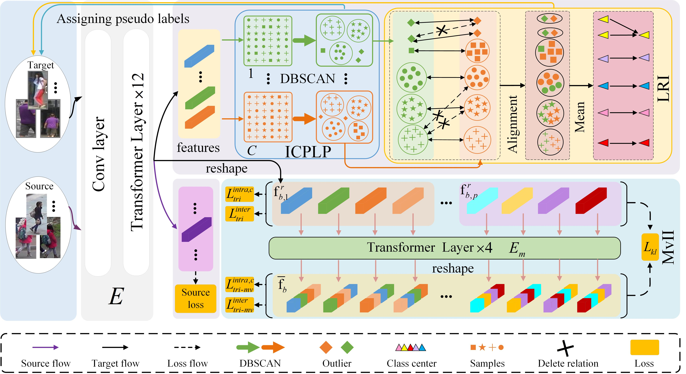

# Logical Relation Inference and Multi-view Information Interaction for Domain Adaptation Person Re-identification

The *official* repository for  [Logical Relation Inference and Multi-view Information Interaction for Domain
Adaptation Person Re-identification].

## Pipeline



## Requirements

### Installation

```bash
pip install -r requirements.txt
(we use /torch 1.8.0 /torchvision 0.9.0 /timm 0.4.12 /cuda 11.1.1 / 24G  RTX3090 for training and evaluation.)

```

### Prepare Datasets

```bash
mkdir data
```

Download the person datasets [Market-1501](https://drive.google.com/file/d/0B8-rUzbwVRk0c054eEozWG9COHM/view), [MSMT17](https://arxiv.org/abs/1711.08565), [DukeMTMC-reID](https://arxiv.org/abs/1609.01775), 
[MSMT17-New](https://github.com/lhf12278/DRDL)
,[Market1501-New](https://github.com/lhf12278/DRDL).
Then unzip them and rename them under the directory like.

```
data
├── market1501
│   └── images ..
├── dukemtmcreid
│   └── images ..
└── MSMT17
    └── images ..
```

### Prepare ViT Pre-trained Models

You need to download the ImageNet pretrained transformer model : [ViT-Base](https://github.com/rwightman/pytorch-image-models/releases/download/v0.1-vitjx/jx_vit_base_p16_224-80ecf9dd.pth)

## Example #1 :
Transferring from [DukeMTMC-reID](https://arxiv.org/abs/1609.01775) to [Market-1501](https://www.cv-foundation.org/openaccess/content_iccv_2015/papers/Zheng_Scalable_Person_Re-Identification_ICCV_2015_paper.pdf).


### Train
We utilize 1 RTX-3090 GPU for training.

#### Stage I: Pre-training on the source domain

```shell
python pre_source.py --config_file configs/vit_base_pre_duke.yml
```

#### Stage II: End-to-end training target domain
```shell
python train.py --config_file configs/d2m.yml
```


## Evaluation

```bash
python test.py --config_file configs/d2m.yml
```

## Download Trained Models
*Our LRIMV models in the paper will be able to downloaded from the [link]().*


## Acknowledgement

Our code is based on [TransReID](https://github.com/damo-cv/TransReID) and [MMT](https://github.com/yxgeee/MMT).


